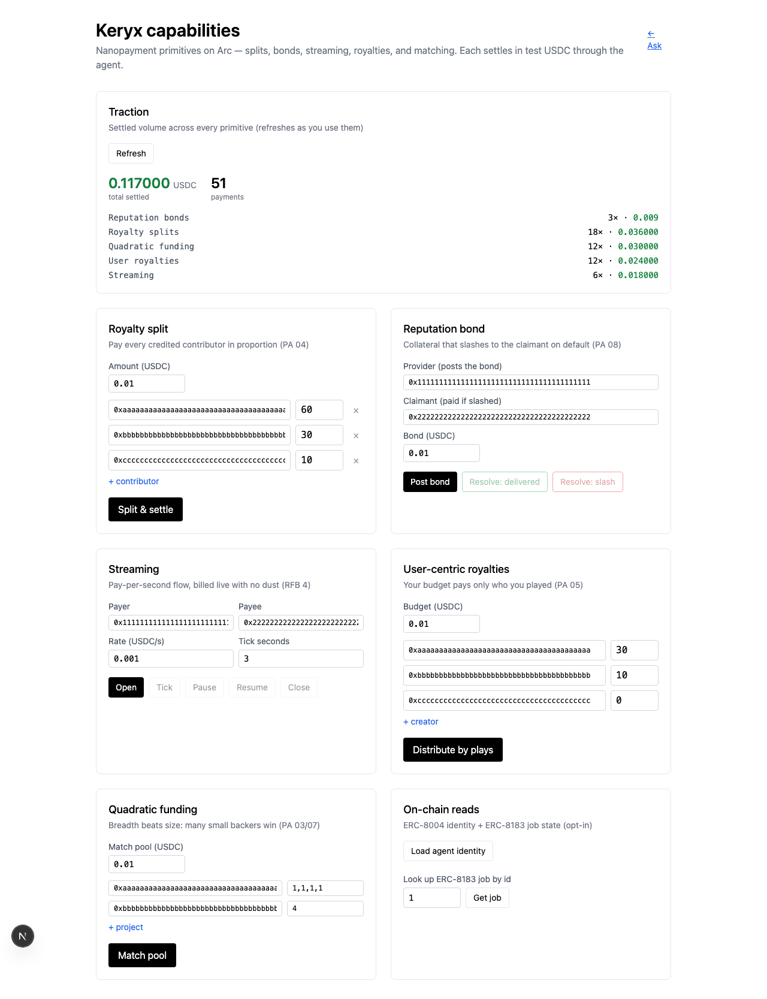

# Keryx

> Your work earns every time an agent cites it.

Keryx is a **citation-toll layer for the agent web**. A paying research agent answers a
query, proves which sources actually grounded its answer, and settles a sub-cent USDC
nanopayment to each cited author on **Arc**. Payment is on *citation*, not on *fetch* —
a source that was read but didn't ground the answer earns $0, visibly.

Built for the Lepton Agents Hackathon (Canteen × Circle, on Arc). Full spec in
[`docs/prd.md`](docs/prd.md); roadmap in [`docs/phases.md`](docs/phases.md).

## Architecture

```
rail/      payments: x402 seller, EIP-3009 verify, Gateway batch, wallets   (CC-A)
agent/     research agent, retrieval, grounding verifier, attestation       (CC-B)
registry/  author->wallet map + RSSHub ingest                               (CC-B)
web/       Next.js ask page + live ledger (chain reads via viem)
shared/    frozen contract: CitationIntent, Receipt, Attestation, Rail
db/        Neon migrations (index/registry/cache only — chain is canonical)
contracts/ on-chain attribution layer (Foundry): ERC-8004-inspired identity/reputation/
           validation + signed-attestation log + weighted citation splitter (USDC still
           settles via Circle Gateway — we don't reimplement it)
```

**Chain is the ledger.** Settlement clears on Arc; Postgres (Neon + pgvector) holds only
a fast read-index, the author→wallet registry, and a source cache. Never Supabase.

## One-command demo (zero funds)

```bash
python3.11 -m venv .venv && .venv/bin/pip install -e ".[dev]"
make demo     # starts the agent, runs the full citation loop + fleet, prints metrics
```

Shows the whole system working (answer → grounded citations → settlement → verified
attestation → traction metrics) against the mock rail — no testnet funds needed. For
real on-chain settlement, see "The rail" below.

## Nanopayment capabilities

Beyond the citation toll, Keryx exposes the full set of sub-cent primitives the Lepton
round is about — each settles in test-USDC through the rail, with **exact, dust-free**
splits (every payout sums to the input down to the micro-USDC, never overpaying):

| Primitive | Endpoint | What it does |
| --- | --- | --- |
| Royalty splits | `POST /payout` | pay every credited contributor in proportion (attribution → payout) |
| Reputation bonds | `POST /bond`, `…/resolve` | collateral that slashes to the claimant on default; ±100 reputation |
| Streaming | `POST /stream`, `…/tick` | pay-per-second flow, billed live with fractional carry |
| User royalties | `POST /royalties` | a listener's budget pays only who they played, with play-gating |
| Quadratic funding | `POST /qf` | match a pool by breadth `(Σ√c)²` — many small backers beat one big |
| Traction | `GET /traction`, `/history` | settled volume rolled up + a unified recent-settlements feed |
| On-chain (opt-in) | `GET /identity`, `/job/{id}`, `/validation/{h}` | ERC-8004 identity/reputation/validation + ERC-8183 job escrow |

**Ported from Circle's open-source Arc repos** (vendored under `vendor/circle/`, see [`NOTICE`](NOTICE)) —
each the offline analogue of the upstream, settling through the same rail:

| Capability | Endpoint | Ported from |
| --- | --- | --- |
| Stablecoin swap | `POST /swap` | `arc-stablecoin-fx` |
| Split-bill request | `POST /request`, `…/fulfil` | `arc-p2p-payments` |
| Prepaid credits + tiers | `POST /credits/topup`, `GET /credits/tiers` | `arc-commerce` |
| Approved-action workflow | `POST /workflow/approve`, `…/execute` | `circle-ooak` |
| Refund / dispute | `POST /refund/{tx}` | `refund-protocol` |
| Structured + confidential + threaded memos | `GET /memos`, `/memo/{tx}/thread` | `recibo` |
| Treasury + sweep | `GET /treasury`, `POST /treasury/sweep` | `arc-fintech` |
| Gateway unified balance | `POST /gateway/deposit`, `…/spend` | `arc-multichain-wallet` |
| Milestone escrow | `POST /escrow`, `…/release` | `arc-escrow` |
| Agent-tool manifest | `GET /agent/tools`, `/capabilities` | `agent-stack-starter-kits` |

Keryx is **agent-callable**: `GET /agent/tools` returns its primitives as tool-use schemas
(Claude Agent SDK / OpenAI function-calling), and `GET /capabilities` indexes all 19 with
their provenance.

```bash
make capabilities-demo    # boots the agent, drives every primitive, prints rolled-up /traction
```

Full reference with copy-paste `curl` for each: [`docs/CAPABILITIES.md`](docs/CAPABILITIES.md).
A live UI for all of them is the web **`/capabilities`** dashboard:



## Quickstart (Python: agent + grounding moat)

```bash
python3.11 -m venv .venv && source .venv/bin/activate
pip install -e ".[dev]"
cp .env.example .env                  # optional; sane defaults built in

pytest                                # 41 tests (contract, grounding, LLM judge/answerer, attestation, pipeline, ledger)
uvicorn agent.main:app --reload       # CC-B -> http://127.0.0.1:8000

# Ask a question (full citation loop against the mock rail):
curl -s -X POST localhost:8000/ask -H 'content-type: application/json' \
  -d '{"query":"How do Gateway nanopayments settle sub-cent USDC on Arc?"}' | jq
# Traction metrics + ledger:
curl -s localhost:8000/metrics | jq
# Generate volume:
python -m agent.fleet --n 20
```

Agent endpoints: `POST /ask`, `GET /ledger`, `GET /metrics`, `GET /traction`, `GET /config`,
`GET /healthz`, plus the nanopayment primitives above (`/payout`, `/bond`, `/stream`,
`/royalties`, `/qf`) and opt-in on-chain reads — see [`docs/CAPABILITIES.md`](docs/CAPABILITIES.md).

## Quickstart (web surface)

```bash
cd web && pnpm install
cp .env.example .env.local            # AGENT_URL=http://127.0.0.1:8000
pnpm dev                              # http://localhost:3000  (ask page + /ledger)
```

## The rail (M0 gate + real settlement)

The x402 + Gateway SDK is TypeScript-only, so the rail is TS and bridges to the Python
agent over the frozen `shared/` contract (see `DECISIONS.md`). The Python agent settles
through `shared.rail.HttpRail` → `rail/m0_spike/payer.ts` → Circle Gateway on Arc; until
then it uses `shared.rail.MockRail` (the swap is one line).

```bash
cd rail/m0_spike && npm install
npm run generate-wallets              # AUTHOR (payee) + BUYER (funder)
# Fund BUYER with Arc testnet USDC: https://faucet.circle.com/  (needs your auth)
npm run seller                        # citation-toll seller (/cite)
npm run payer                         # rail bridge the agent settles through
npm run m0                            # drive ONE payment -> prints tx + explorer URL
```

See `rail/m0_spike/README.md` and `docs/VERIFIED-SIGNATURES.md` for the verified
constants and the full M0 procedure.

## Database

```bash
psql "$KERYX_DATABASE_URL" -f db/migrations/0001_init.sql
python scripts/db_check.py           # verifies reachability + pgvector + schema
```

## How it works (the citation loop)

1. A query arrives (our page, our agent fleet, or an external agent).
2. The agent retrieves candidate sources (RSSHub `DataItem.link` + `author`).
3. The agent generates an answer.
4. **Grounding verifier** (`agent/grounding/`, the moat): similarity + LLM-judge → `g ∈ [0,1]`.
   The judge is Claude (`AnthropicJudge`, per-claim `supported|partial|unsupported` via
   structured outputs) when `KERYX_ANTHROPIC_API_KEY` is set, else a deterministic offline
   heuristic — same interface, so CI and the zero-config demo stay reproducible.
5. For each source with `g ≥ T`, settle a citation toll: x402 → Gateway batch → Arc.
6. The agent emits a **signed attestation** (`agent/attestation/`) mapping answer → sources → amounts → tx hashes.
7. The dashboard reads the **chain** (canonical) and renders live.

## Status

All phases are **engineered and verified end-to-end against the mock/local rail**; the
only remaining steps are the live on-chain runs, which need Arc testnet USDC from the
Circle faucet (your authentication) — see `SETUP.md`.

| Phase | What's done | Gated on |
| --- | --- | --- |
| 0 Foundation | scaffold, frozen contract, Neon schema, CI, licensing | — ✅ |
| 1 M0 rail spike | verified signatures, runnable spike, seller emits correct 402 | funded tx (faucet) |
| 2 M1 agent | grounding moat (Claude judge + answerer, heuristic fallback) + attestation + `/ask` + registry (41 tests) | — ✅ |
| 3 M2 integration | TS payer bridge + `HttpRail`; pipeline runs unchanged against it | live settlement (funds) |
| 4 M3 surface | ask page + `/ledger` + attestation viewer; prod build green | Vercel deploy + funds |
| 5 M4 traction | ledger, team-vs-external metrics, fleet runner | real volume (funds) + Discord |
| 6 M5 ship | reviewer-ready README, NOTICE | video + form submission |
| On-chain layer | Foundry suite: ERC-8004-inspired identity/reputation/validation, signed-attestation registry, weighted splitter, settlement orchestrator (18 forge tests) | testnet deploy (funds) |

See [`docs/phases.md`](docs/phases.md) for per-phase detail and [`DECISIONS.md`](DECISIONS.md)
for resolved decisions.

## Licensing

Our code is MIT (see [`LICENSE`](LICENSE)). Vendored upstreams keep their own licenses
and are attributed in [`NOTICE`](NOTICE).
