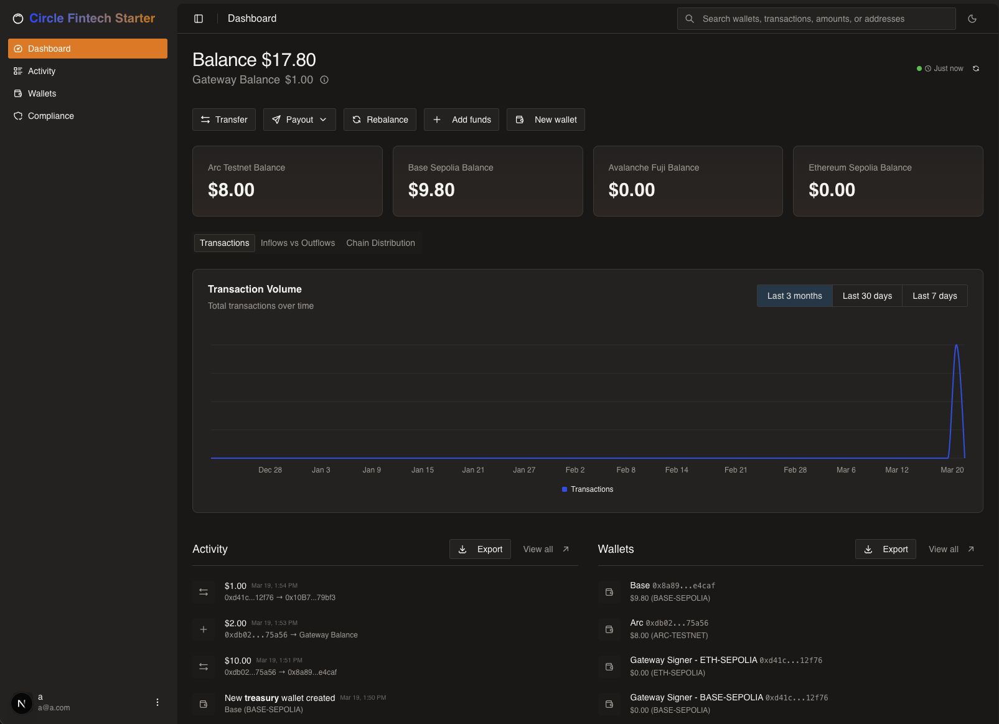

# Arc Fintech Starter App

Modern multi-chain treasury management system. This sample application uses Next.js, Supabase, and Circle Developer Controlled Wallets, Circle Gateway and Circle Bridge Kit with Forwarding Service to demonstrate a multi-chain treasury management system with bridge capabilities.



## Table of Contents

- [Prerequisites](#prerequisites)
- [Getting Started](#getting-started)
- [How It Works](#how-it-works)
- [Environment Variables](#environment-variables)
- [User Accounts](#user-accounts)

## Prerequisites

- **Node.js v22+** — Install via [nvm](https://github.com/nvm-sh/nvm)
- **Supabase CLI** — Install via `npm install -g supabase` or see [Supabase CLI docs](https://supabase.com/docs/guides/cli/getting-started)
- **Docker Desktop** (only if using the local Supabase path) — [Install Docker Desktop](https://www.docker.com/products/docker-desktop/)
- Circle Developer Controlled Wallets **[API key](https://console.circle.com/signin)** and **[Entity Secret](https://developers.circle.com/wallets/dev-controlled/register-entity-secret)**

## Getting Started

1. Clone the repository and install dependencies:

   ```bash
   git clone git@github.com:akelani-circle/fintech-starter.git
   cd fintech-starter
   npm install
   ```

2. Set up environment variables:

   ```bash
   cp .env.example .env.local
   ```
   Replace `your-ngrok-url` with your actual ngrok forwarding URL from step 4.

   Then edit `.env.local` and fill in all required values (see [Environment Variables](#environment-variables) section below).

3. Set up the database — Choose one of the two paths below:

   <details>
   <summary><strong>Path 1: Local Supabase (Docker)</strong></summary>

   Requires Docker Desktop installed and running.

   ```bash
   npx supabase start
   npx supabase migration up
   ```

   The output of `npx supabase start` will display the Supabase URL and API keys needed for your `.env.local`.

   </details>

   <details>
   <summary><strong>Path 2: Remote Supabase (Cloud)</strong></summary>

   Requires a [Supabase](https://supabase.com/) account and project.

   ```bash
   npx supabase link --project-ref <your-project-ref>
   npx supabase db push
   ```

   Retrieve your project URL and API keys from the Supabase dashboard under **Settings → API**.

   </details>

4. Start the development server:

   ```bash
   npm run dev
   ```

   The app will be available at `http://localhost:3000`.

## How It Works

- Built with [Next.js](https://nextjs.org/) App Router and [Supabase](https://supabase.com/)
- Uses [Circle Developer Controlled Wallets](https://developers.circle.com/wallets/dev-controlled) for managing multi-chain transactions
- Utilizes `@circle-fin/bridge-kit` for bridging assets across supported chains
- Real-time UI updates powered by Supabase Realtime subscriptions
- Styled with [Tailwind CSS](https://tailwindcss.com) and components from [shadcn/ui](https://ui.shadcn.com/)

## Environment Variables

Copy `.env.example` to `.env.local` and fill in the required values:

```bash
# Supabase
NEXT_PUBLIC_SUPABASE_URL=your-project-url
NEXT_PUBLIC_SUPABASE_PUBLISHABLE_KEY=your-publishable-or-anon-key
SUPABASE_SERVICE_ROLE_KEY=your-service-role-key

# Circle
CIRCLE_API_KEY=your-circle-api-key
CIRCLE_ENTITY_SECRET=your-circle-entity-secret
```

| Variable | Scope | Purpose |
| --- | --- | --- |
| `NEXT_PUBLIC_SUPABASE_URL` | Public | Supabase project URL. |
| `NEXT_PUBLIC_SUPABASE_PUBLISHABLE_KEY` | Public | Supabase anonymous/publishable key. |
| `SUPABASE_SERVICE_ROLE_KEY` | Server-side | Supabase service role key for admin operations. |
| `CIRCLE_API_KEY` | Server-side | Circle API key for wallet operations. |
| `CIRCLE_ENTITY_SECRET` | Server-side | Circle entity secret for signing transactions. |

## User Accounts

### Default Account

On first visit, sign up with any email and password.

## Security & Usage Model

This sample application:
- Assumes testnet usage only
- Handles secrets via environment variables
- Is not intended for production use without modification
