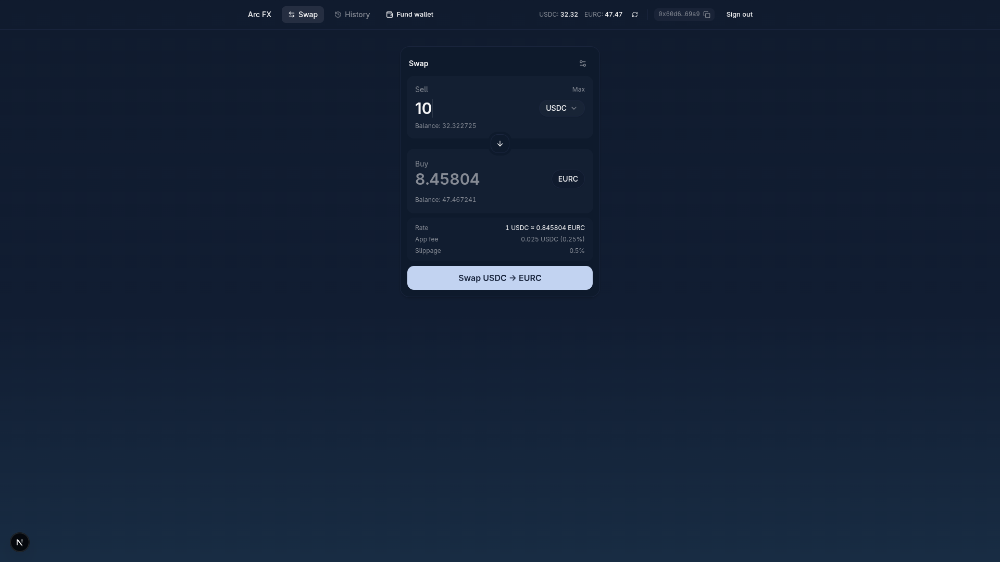

# arc-stablecoin-fx

This sample app demonstrates stablecoin FX swaps between USDC and EURC using the App Kits Swap SDK and Circle Developer Controlled Wallets on Arc.



## Getting started

### Prerequisites

- Node.js 20+ and npm
- Docker (for local Supabase)
- A [Circle](https://console.circle.com) account with API key + entity secret
- A Circle App Kit `KIT_KEY`

### 1. Install dependencies

```sh
npm install
```

### 2. Start the local Supabase stack

```sh
npm run db:start
```

This boots Postgres, Auth, etc. via the Supabase CLI and runs the migrations in
`supabase/migrations/`. Use `npm run db:status` to print the local URLs and keys,
`npm run db:reset` to wipe + re-migrate, and `npm run db:stop` to shut it down.

### 3. Configure environment

Copy the example file and fill in the blanks:

```sh
cp .env.example .env.local
```

- `NEXT_PUBLIC_SUPABASE_URL` / `NEXT_PUBLIC_SUPABASE_PUBLISHABLE_KEY` /
  `SUPABASE_SECRET_KEY` - from `npm run db:status`.
- `CIRCLE_API_KEY` - from the Circle console.
- `CIRCLE_ENTITY_SECRET` - your 32-byte hex entity secret. Must be registered
  with Circle once before use.
- `CIRCLE_BLOCKCHAIN` - Circle blockchain identifier (default `ARC-TESTNET`).
- `KIT_KEY` - Circle App Kit key.
- `NEXT_PUBLIC_ARC_CHAIN` - App Kit chain identifier (default `Arc_Testnet`).
- `APP_FEE_BPS` - platform fee in basis points (default `25` = 0.25%).
- `APP_FEE_RECIPIENT` - leave blank, then run the script below.

### 4. Provision the platform fee wallet

Creates a Circle wallet to receive swap fees and writes its address back to
`.env.local` as `APP_FEE_RECIPIENT`:

```sh
npm run wallet:generate
```

### 5. Run the dev server

```sh
npm run dev
```

App is at http://localhost:3000.

## Project layout

- `src/app/(auth)/` - register / login flows
- `src/app/(app)/dashboard/` - authenticated swap panel
- `src/app/(app)/dashboard/history/` - trades history
- `src/app/api/webhooks/circle/` - Circle webhook receiver
- `src/components/swap/`, `src/components/trades/`, `src/components/wallet/` - feature UI
- `src/lib/circle/`, `src/lib/appkit/` - Circle wallets + App Kit integration
- `src/lib/supabase/` - Supabase client/server/admin helpers
- `supabase/migrations/` - database schema
- `scripts/` - one-off operator scripts
